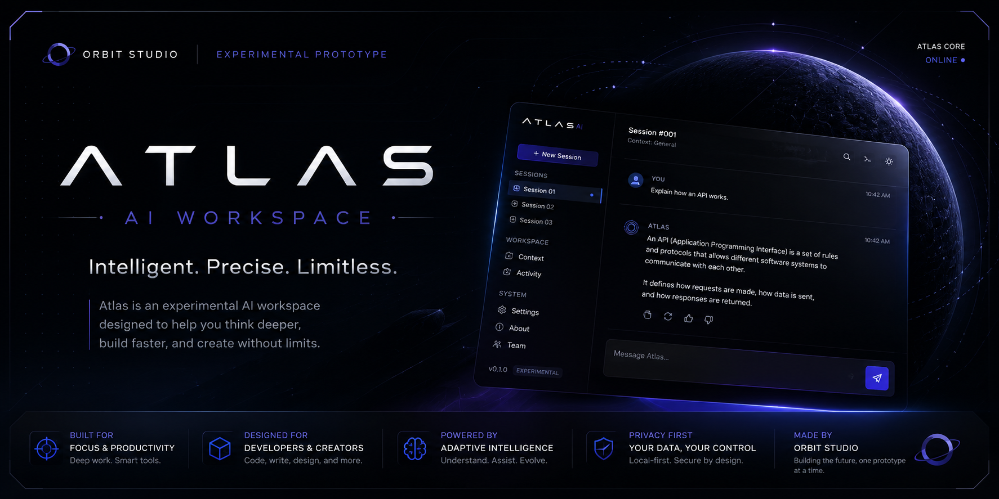

# Atlas AI Workspace



**Atlas** is an experimental design prototype by **Orbit Studio** — a polished,
believable AI workspace interface with no backend, no database, and no
external AI connected. Everything you see runs locally in the browser:
chat is simulated, sessions live in `localStorage`, and the goal is purely
interaction and interface design, not a functioning AI product.

> This is **not** the official Atlas AI product — it's an experimental
> prototype for exploring the interface of Orbit Studio's own AI system.

---

## Status

| | |
|---|---|
| Version | `0.1.0` |
| Status | Experimental Prototype |
| Studio | Orbit Studio |

## Stack

Vanilla HTML5, CSS3, and JavaScript (ES Modules) only — no framework, no
build step, no external UI libraries.

- HTML5 / CSS3 / Vanilla JavaScript
- ES Modules (`import` / `export`)
- `localStorage` for persistence
- Inline SVG for icons and the brand mark

## Features

- **Landing page** — shown after boot for signed-out visitors, introducing
  Atlas and its features before any sign-in is required
- **Terminal-style splash screen** — character-by-character boot sequence
- **Sign In / Sign Up / Guest** — simulated auth gate (no real backend);
  any valid-looking email + password (4+ characters) works, session
  persists in `localStorage`, "Log out" available from Settings
- **Photo attachments & Text-to-speech** — visible, wired-up UI controls
  that make the intended feature clear; clicking either shows a toast
  noting it's a prototype placeholder, not a real implementation
- **Push to GitHub** — a fully-animated, multi-step "generate repo →
  choose visibility → push" flow (single floating card, gradient step
  indicator, fade/slide transitions). This is a polished demo of the
  experience, not a live GitHub connection — no network request is made
  and no repository is created; the final "Open GitHub" click makes that
  explicit. Also reachable directly from the sidebar profile row
- **Categorized Settings** — General, Appearance, AI Providers,
  Connections, Privacy, and Shortcuts, plus a persistent Support &
  Community section
- **Discord community flow** — Community Rules confirmation → an
  animated countdown ("Community Access" 5→0, then a celebratory
  "BOOM!") → "Opening Discord...". Like the GitHub flow, this is a
  polished demo — no real Discord invite is opened, and a toast makes
  that explicit at the end
- **Sessions** — create, switch, rename, delete, persisted to `localStorage`
- **Simulated chat** — local keyword-matched responses with a typing effect
  (try `help`, `what is an api`, `explain python`, `build a website`)
- **Command palette** (`Ctrl+K`) — new session, search sessions, toggle
  theme, settings, about
- **Dark / light theme** — deliberately designed independently, not a
  simple color inversion; persisted and falls back to system preference
- **Settings** — accent color, font size, compact mode, animations,
  sound effects, Enter vs. Ctrl+Enter to send, export sessions as JSON,
  clear local data
- **Mobile-first** — sidebar becomes a drawer, keyboard-safe composer via
  the VisualViewport API, no horizontal overflow at 360–1440px+
- **Accessible** — semantic HTML, `aria-label`s, keyboard navigation,
  `:focus-visible`, reduced-motion support

## Running locally

No install step — this is a static site. Because it uses ES Modules,
open it through a local server rather than the `file://` protocol (module
imports are blocked by CORS when opened directly as a file):

```bash
cd atlas-prototype-desain
python3 -m http.server 8000
```

Then open `http://localhost:8000` in your browser.

## Project structure

```
atlas-prototype-desain/
├── index.html
├── assets/
│   ├── atlas.svg              # standalone brand mark (favicon)
│   ├── banner.png             # this README's banner
│   └── orbit-studio.png       # Orbit Studio logo, shown in About
├── css/                       # one file per responsibility — see below
└── js/                        # ES modules, one per responsibility
```

**CSS** — `variables.css` (tokens), `themes.css` (dark/light palettes),
`reset.css`, `base.css`, `layout.css`, `sidebar.css`, `header.css`,
`chat.css`, `input.css`, `splash.css`, `modal.css`, `about.css`,
`team.css`, `settings.css`, `responsive.css`.

**JavaScript** — `main.js` (entry point), `splash.js` (boot animation),
`auth.js` (simulated sign-in/guest/log-out), `chat.js` (simulated
responses + rendering), `sessions.js` (session CRUD + persistence),
`sidebar.js` (drawer + session list), `theme.js`, `settings.js`,
`storage.js` (safe `localStorage` wrapper), `mobile.js` (viewport/keyboard
handling), `command-palette.js`, `github-flow.js` (Push to GitHub demo
state machine), `utils.js`.

## Team

Built by **Orbit Studio**:

- **Iky** — Founder
- **Lana** — Co-Creator
- **Dei** — Co-Creator

## License

Internal prototype — not licensed for redistribution.
